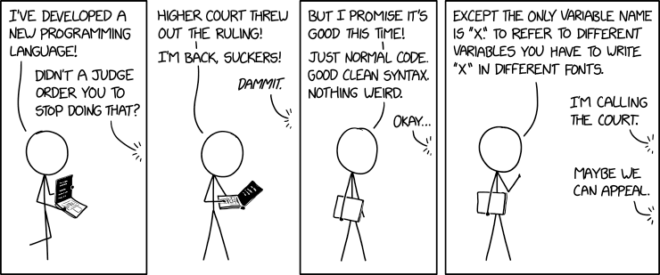

# Key Fundamental Principles for Software Engineering

This software engineering course had been an interesting and fast paced course.  Quite a few topics and concepts were covered, collaborative works and exercises, along with several reflections on class material.  Being new to the area, I was able to learn a great deal throughout the course from becoming familiar with using JavaScript to utilizing issue-driven project management practices.  Out of everything covered in the course, two key takeaways I have from the course are coding standards and development environments.

### Coding Standards

Standards are used in a variety of areas within personal and professional capacities.  Standards are established norms of common guidelines, conditions, or characteristics.  Using coding standards in this course I could see the effectiveness in managing group development projects, reviewing code, and ensuring all members are able to gain a shared understanding in developing code.  From the number of spaces between lines to how to label specified variables or standardized methods, the goal is improving productivity by establishing a sense of uniformity for ease of interpretation and possible debugging.  Some individuals may view enforcement of coding standards a nuisance and a waste of time.  Having been a part of teams that had not leveraged coding standards, I witnessed the variety of situations that led to confusion, uncertainty, and wasted time.  Even some of my own coding projects turned messy and incoherent at times.  The use and enforcement of coding standards is something I intend to continue to build on.

### Development Environments

Development environments is the other topic I intend to continue building on.  These development environments consist of a centralized set of tools that assist developers by facilitating things such as tracing, testing, and debugging code.  This idea can be compared to a cook.  The development environment for this cook (developer) entails having tools in a kitchen such as pots/pans, utensils, recipes, and ingredients in a central location.  Having a variety of integrated tools, I quickly saw the benefits of having an effective work environment for routine tasks in development, testing, and debugging when working with complex code.

### Moving Forward

I have had an overall good experience throughout this course.  Although it was more time consuming for me since I was introduced to JavaScript and web development in this course, I was satisfied with my progression.  Coding standards and development environments were the key takeaways for me, however, I’m sure each of the other topics covered will play a role in some way, shape, or form. 
