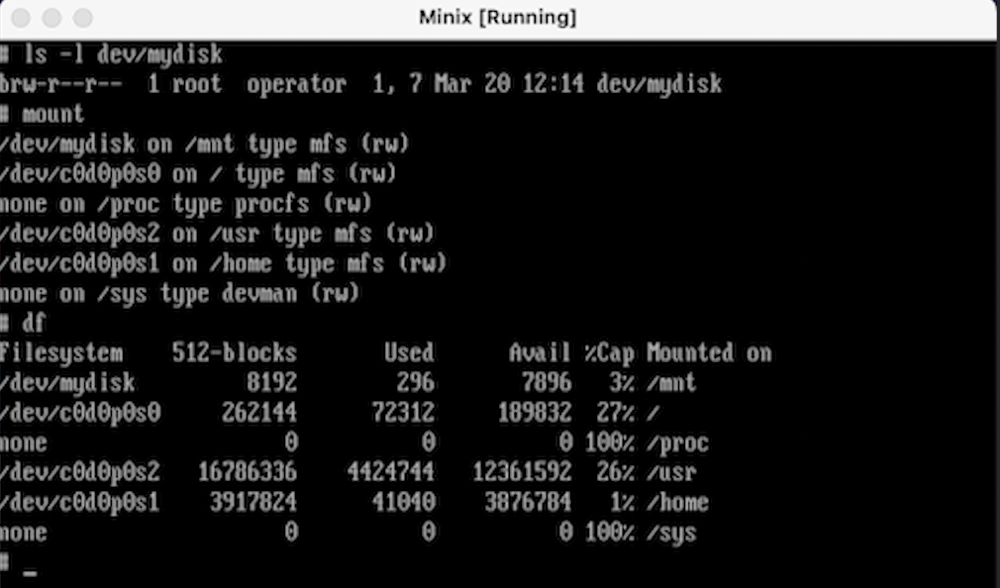

The idea of having an Operating System (OS) available to easily modify for the illustration of design principles is what MINIX embodies.  Minix is a “bare metal” Unix-like open source OS primarily used for student learning.  It is a text oriented operating system with a "minimal" kernal containing approximately 6,000 lines of code.  More info can be found here [Minix homepage](https://www.minix3.org/).    

## Editing Source Code

During a course in the Theory of Operating Systems, my project involved successfully adding a new ram disk device (aptly named “mydisk”) to this system.  The goal for this project was to become familiar with device management as well as disk mounting in any Unix-like OS.  As previously mentioned, MINIX is a “bare metal” OS that took quite a few steps to accomplish.  Using VirtualBox, I was first able to successfully install the OS, appropriately partition memory, and understand the file hieracrhy before editing the source code.  Several of the steps inluded:
>> -Listing the new ram disk as an additional minor device

>> -Increasing the limit of ram disks

>> -Creating the new ram disk as a block device

>> -Initializing the the OS on the newly created ram disk

Once Completed, I was able to successfully boot the OS and view the newly created ram disk as below.

## Output Example

 
 
## Takeaway

One of the things I felt that I have learned at the end of the project is how comfortable I had been working in a GUI environment vs a command line.  The project required me to constantly edit and recompile the source code of the Minix OS.  This allowed me to  gain more of an understanding working with the C programming language as well through hours of sifting through functions and header files of the source code.  Since my work was done through a virtual machine, I had a stern reminder that troubleshooting involves not only the programming code but the environment as well (i.e. computer memory, compatibility, etc.)

