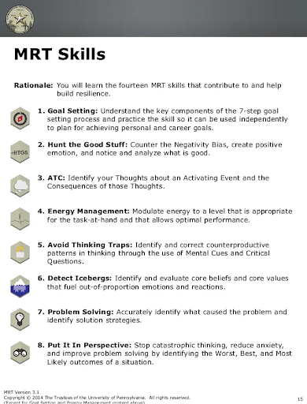

Resilience, in the realm of psychology, is interpreted as, “the process of adapting well in the face of adversity, trauma, tragedy, threats, or significant sources of stress—such as family and relationship problems, serious health problems, or workplace and financial stressors.” (Building Resilience).   

I had been responsible for identifying, coordinating, and conducting resilience training for an organization of over 100 personnel.  This took significant time working with other team members in terms of planning, preparing, executing, and assessing the training.  My role primarily involved managing the flow of information, timelines, coordination of equipment and preparing a block of instruction.  

For me, this endeavor reinforced the importance of preparation and teamwork.  Products needed to be prepared and rehearsals needed to be done well beforehand in order to be successful here.  Inherently, communication and presentation skills were instrumental for the training.  Feedback received after the training gave me notes that I could leverage for future training events.

##Description
 

